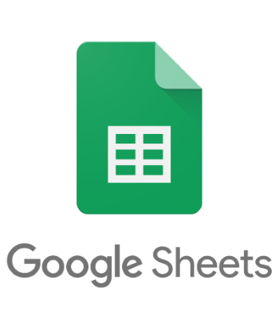

<!--
*** Thanks for checking out the Best-README-Template. If you have a suggestion
*** that would make this better, please fork the fs_drms_demo and create a pull request
*** or simply open an issue with the tag "enhancement".
*** Thanks again! Now go create something AMAZING! :D
***
***
***
*** To avoid retyping too much info. Do a search and replace for the following:
*** github_username, fs_drms_demo_name, twitter_handle, email, project_title, project_description
-->


<!-- PROJECT SHIELDS -->
<!--
*** I'm using markdown "reference style" links for readability.
*** Reference links are enclosed in brackets [ ] instead of parentheses ( ).
*** See the bottom of this document for the declaration of the reference variables
*** for contributors-url, forks-url, etc. This is an optional, concise syntax you may use.
*** https://www.markdownguide.org/basic-syntax/#reference-style-links
-->


[](https://lbesson.mit-license.org/)


<!-- PROJECT LOGO -->
<br />
<p align="center">
  <a href="https://github.com/MooseandSquvirrel/fs_drms_demo.git">
    
  </a>

  <h3 align="center">Open Close Command-line Program</h3>

  <p align="center">
  	Demo version of script for opening and closing bootcamp students' accounts.
    <br />
    <a href="https://github.com/MooseandSquvirrel/fs_drms_demo.git"><strong>Explore the docs »</strong></a
  </p>
</p>


<!-- TABLE OF CONTENTS -->
<details open="open">
  <summary><h2 style="display: inline-block">Table of Contents</h2></summary>
  <ol>
    <li>
      <a href="#about-the-project">About The Project</a>
      <ul>
        <li><a href="#built-with">Built With</a></li>
      </ul>
    </li>
    <li>
      <a href="#getting-started">Getting Started</a>
      <ul>
        <li><a href="#prerequisites">Prerequisites</a></li>
        <li><a href="#installation">Installation</a></li>
      </ul>
    </li>
    <li><a href="#usage">Usage</a></li>
    <li><a href="#license">License</a></li>
    <li><a href="#contact">Contact</a></li>
  </ol>
</details>


<!-- ABOUT THE PROJECT -->
## About The Project

<p align="center">
  <a href="https://github.com/MooseandSquvirrel/fs_drms_demo.git">
    
  </a>
 </p>

This commandline program was a script I decided to create when I noticed one of my fellow interns working 
alone and for too many hours on a very manual task. I wanted to help. My fellow intern was tasked with opening or 
closing bootcamp student accounts depending on whether they passed their room inspections for the housing. 
<br /><br /> 
The RA's for the dorms used an Excel spreadsheet so to keep it familiary, I utilized an almost identical format with Google Sheets. This allowed me to design a simple familiar form to be filled out, and also allowed for automation using the Google Sheets API. Data from the inspections was pulled from the form's cells, stored, and then depending the results, chose which students accounts to temporarily close or reopen using the school's API. It took a 4 - 5 hour task and made it a 15 - 30 seconds. 

### Built With

* [Python 3](https://www.python.org/)
* [Google Sheets](https://www.google.com/sheets/about/)


<!-- GETTING STARTED -->
## Getting Started

The official desktop application was not meant for being open-sourced and therefore
is not for use in it's full functionality to be reproduced locally. This is because of the permissions required including: staff/employee permissions, API scope and other necessary info not accessible to the public. The application's code has been modified and commit history scrubbed. Confidential information and files integral to its functioning have therefore been removed. 

To see the code, please visit: <a href="https://github.com/MooseandSquvirrel/fs_drms_demo.git">The Code</a>
<br />

### Prerequisites

* None
  ```sh
  N/A
  ```

### Installation

1. Again, None :). 
   ```sh
   N/A
   ```

<!-- USAGE EXAMPLES -->
## Usage

This project is not meant for reproduction in its full fuctionality and is more for demo/portfolio purposes.

<!-- LICENSE -->
## License

Distributed under the MIT License. See `LICENSE` for more information.


<!-- CONTACT -->
## Contact

Andy Gardner - web.dev.bud1@gmail.com

Project Link: [https://github.com/MooseandSquvirrel/fs_drms_demo.git](https://github.com/MooseandSquvirrel/fs_drms_demo.git)


### Attribute

[logo](https://www.flaticon.com/free-icon/open_1169906?term=open%20close&page=1&position=9&related_item_id=1169906)


